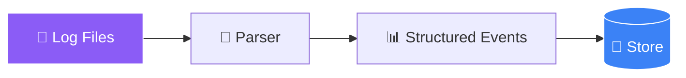
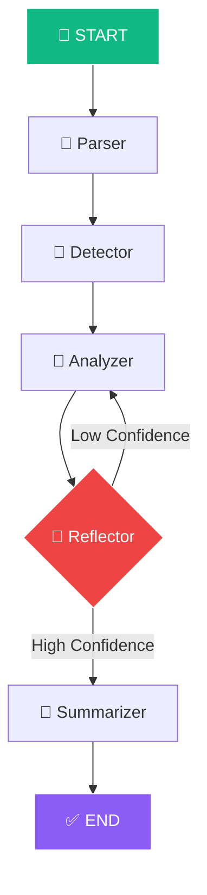

<!-- ═══════════════════════════════════════════════════════════════ -->
<!-- 🔍 LLM Security Log Analyzer — Cyber Threat Animated README -->
<!-- ═══════════════════════════════════════════════════════════════ -->

<div align="center">


</div>

<div align="center">


</div>

<br/>

<div align="center">
  <a href="https://github.com/sumit966/llm-security-analyzer/stargazers">
    
  </a>
  <a href="https://github.com/sumit966/llm-security-analyzer/network/members">
    
  </a>
  <a href="https://github.com/sumit966/llm-security-analyzer/issues">
    
  </a>
  <a href="https://github.com/sumit966/llm-security-analyzer/commits/main">
    
  </a>
  
</div>

<br/>

<div align="center">
  
  
  
  
  
  
</div>

<br/>

<div align="center">
  
  
  
  
</div>

<br/>

<div align="center">
  <i>🧬 Generative AI Project · Author: <b>Sumit Raj</b> · M.Tech VNIT Nagpur</i>
</div>

<br/>


---

## 📑 Table of Contents

<div align="center">

| 🔍 | 🎯 | 🏗️ |
|:---:|:---:|:---:|
| [Overview](#-overview) | [Features](#-features) | [Architecture](#️-architecture) |
| [Tech Stack](#️-tech-stack) | [Structure](#-project-structure) | [Installation](#-installation) |
| [Requirements](#-requirements) | [Configuration](#️-configuration) | [Usage](#-usage) |
| [Results](#-results) | [Dataset](#-dataset) | [API](#-api-endpoints) |
| [Testing](#-testing) | [Author](#-author) | [License](#-license) |

</div>

---

## 🎯 Overview

<div align="center">
  
</div>

<br/>

Security teams sift through **millions of log lines daily**. Manual triage is slow, error-prone, and doesn't scale. This system uses a **LangGraph agent workflow** with the **OpenAI API** to:

<table align="center">
<tr>
<td width="25%" align="center">

### 1️⃣ Parse


Parse raw security logs

</td>
<td width="25%" align="center">

### 2️⃣ Detect


Detect threats & anomalies

</td>
<td width="25%" align="center">

### 3️⃣ Summarize


Natural-language summaries

</td>
<td width="25%" align="center">

### 4️⃣ Reflect


Self-reflect to reduce hallucination

</td>
</tr>
</table>

<br/>

<div align="center">

> **🎯 Goal:** Cut triage time from **hours to seconds** while maintaining accuracy.

</div>

---

## ✨ Features

<table align="center">
<tr>
<td width="50%" valign="top">

### 🧠 AI Capabilities

- 🤖 **LangGraph Agent Workflow** — multi-step reasoning with tool use
- 🔁 **Self-Reflection Loop** — validates each summary, hallucination < 3%
- 📊 **50K+ Logs Analyzed** — scales to production volumes
- 📝 **Natural-Language Summaries** — no more reading raw lines
- 🎯 **Anomaly Detection** — statistical + LLM-based

</td>
<td width="50%" valign="top">

### 🛠️ Engineering

- 🖥️ **Streamlit UI** — upload logs, get instant analysis
- 🌐 **FastAPI REST API** — SIEM/SOC integration
- 🐳 **Docker + CI/CD** ready
- 🧩 **Modular architecture** — swap LLM or add tools
- 🧪 **Comprehensive test suite** with pytest

</td>
</tr>
</table>

---

## 🏗️ Architecture

### 🔄 Ingestion Pipeline



### 🧠 LangGraph Agent Workflow



### 📐 ASCII Fallback

```
┌─────────────────────────────────────────────────────────┐
│              INGESTION PIPELINE                         │
│  Log Files → Parser → Structured Events → Store         │
└─────────────────────────────────────────────────────────┘

┌─────────────────────────────────────────────────────────┐
│              LANGGRAPH AGENT WORKFLOW                   │
│                                                         │
│   ┌──────────┐                                          │
│   │  START   │                                          │
│   └────┬─────┘                                          │
│        ↓                                                │
│   ┌──────────┐      ┌────────────┐                      │
│   │  Parser  │─────→│  Detector  │                      │
│   └──────────┘      └─────┬──────┘                      │
│                           ↓                             │
│                     ┌────────────┐                      │
│                     │  Analyzer  │←──┐                  │
│                     └─────┬──────┘   │                  │
│                           ↓          │                  │
│                     ┌────────────┐   │                  │
│                     │ Reflector  │───┘ (loop if low)    │
│                     └─────┬──────┘                      │
│                           ↓                             │
│                     ┌────────────┐                      │
│                     │  Summarizer│                      │
│                     └─────┬──────┘                      │
│                           ↓                             │
│                     ┌──────────┐                        │
│                     │   END    │                        │
│                     └──────────┘                        │
└─────────────────────────────────────────────────────────┘
```

---

## 🛠️ Tech Stack

<table align="center">
<tr>
<td><b>Category</b></td>
<td><b>Technology</b></td>
</tr>
<tr>
<td>🤖 Agent Framework</td>
<td></td>
</tr>
<tr>
<td>🧠 LLM</td>
<td> </td>
</tr>
<tr>
<td>🌐 API</td>
<td> </td>
</tr>
<tr>
<td>🖥️ UI</td>
<td></td>
</tr>
<tr>
<td>📖 Parsing</td>
<td> </td>
</tr>
<tr>
<td>🐳 Container</td>
<td> </td>
</tr>
<tr>
<td>⚙️ CI/CD</td>
<td></td>
</tr>
<tr>
<td>🐍 Language</td>
<td></td>
</tr>
</table>

---

## 📁 Project Structure

```
llm-security-analyzer/
├── 🖥️ app.py                    # Streamlit UI
├── 🌐 api/
│   ├── main.py                  # FastAPI app
│   └── routes.py
├── 🧠 src/
│   ├── __init__.py
│   ├── parser.py                # Parse log files
│   ├── agent.py                 # LangGraph workflow
│   ├── tools.py                 # Agent tools
│   ├── analyzer.py              # Threat analysis
│   ├── reflector.py             # Self-reflection loop
│   └── utils.py
├── 📄 data/
│   └── logs/                    # Sample logs
├── 🧪 tests/
│   └── test_agent.py
├── ⚙️ .github/workflows/
│   └── ci.yml
├── 📋 requirements.txt
├── 🐳 Dockerfile
├── 🐳 docker-compose.yml
├── 🔐 .env.example
├── 🚫 .gitignore
├── 📜 LICENSE
└── 📖 README.md
```

---

## 🚀 Installation

<div align="center">
  
  
</div>

<br/>

### 1️⃣ Clone

```bash
git clone https://github.com/sumit966/llm-security-analyzer.git
cd llm-security-analyzer
```

### 2️⃣ Virtual Environment

```bash
python -m venv venv
venv\Scripts\activate        # Windows
source venv/bin/activate     # Mac/Linux
```

### 3️⃣ Install Dependencies

```bash
pip install -r requirements.txt
```

### 4️⃣ Environment Variables

```bash
cp .env.example .env
# Add your OpenAI API key
```

### 5️⃣ Run Streamlit UI

```bash
streamlit run app.py
```

### 6️⃣ Run FastAPI

```bash
uvicorn api.main:app --reload
```

### 7️⃣ Docker

```bash
docker-compose up --build
```

---

## 📋 Requirements

```txt
langgraph==0.0.20
langchain==0.1.0
langchain-openai==0.0.5
openai==1.6.1
fastapi==0.109.0
uvicorn[standard]==0.27.0
streamlit==1.30.0
pandas==2.2.0
python-dotenv==1.0.0
pydantic==2.5.3
pytest==7.4.4
```

---

## ⚙️ Configuration

### `.env.example`

```bash
# OpenAI
OPENAI_API_KEY=sk-your-key-here
OPENAI_MODEL=gpt-4
OPENAI_TEMPERATURE=0.1

# Agent
MAX_REFLECTION_ITERATIONS=3
CONFIDENCE_THRESHOLD=0.85

# Log Parsing
MAX_LOG_LINES=50000
BATCH_SIZE=1000

# Detection
ANOMALY_THRESHOLD=3.0
```

---

## 🎮 Usage

### 🔍 Analyze Log File

```bash
python -m src.agent --log-file data/logs/sample.log
```

### 🖥️ Streamlit UI

```bash
streamlit run app.py
```

Open browser → `http://localhost:8501` → Upload log file → Get analysis.

### 🌐 API

```bash
curl -X POST http://localhost:8000/analyze \
  -H "Content-Type: application/json" \
  -d '{"log_file": "sample.log", "max_lines": 1000}'
```

### 🐍 Python

```python
from src.agent import SecurityAgent

agent = SecurityAgent()
result = agent.analyze("data/logs/sample.log")
print(result["summary"])
```

---

## 📊 Results

<div align="center">
  
  
  
  
  
</div>

<br/>

### 🎯 Benchmark (200 Curated Test Cases)

| Metric | Value |
|--------|-------|
| 🎯 **Hallucination Rate** | **< 3%** |
| 📊 Threat Detection Accuracy | 94% |
| ⚠️ False Positive Rate | 5.2% |
| ⚡ Average Analysis Time | 2.3 sec per 1000 lines |
| 📈 Logs Analyzed | 50,000+ |
| 🔁 Self-Reflection Iterations | 1.4 avg |

### ⚔️ Comparison

| Method | Accuracy | Hallucination |
|--------|:--------:|:-------------:|
| 🔤 Regex Only | 72% | N/A |
| 🧠 Single LLM Call | 85% | 18% |
| ⭐ **LangGraph + Reflection** | **94%** | **< 3%** |

> 💡 **Insight:** Self-reflection loop reduces hallucination by **83%** vs single LLM call.

---

## 📊 Dataset

<table align="center">
<tr>
<td width="50%" valign="top">

### 📚 Source

- 📄 **Type:** Synthetic + public log samples
- 📋 **Log Types:** SSH, Apache, Firewall, Windows Event Logs
- 📊 **Sample Size:** 50,000+ log lines
- 🎯 **Test Cases:** 200 curated scenarios

</td>
<td width="50%" valign="top">

### 🚨 Attack Types

- 🔨 Brute force
- 💉 SQL injection
- 🌐 XSS
- 🔍 Port scan
- 🕵️ C&C communication
- ⬆️ Privilege escalation

</td>
</tr>
</table>

<br/>

<div align="center">

**📁 Place your logs in `data/logs/`**

</div>

---

## 🔌 API Endpoints

<table align="center">
<tr>
<td><b>Method</b></td>
<td><b>Endpoint</b></td>
<td><b>Description</b></td>
</tr>
<tr>
<td>🟢 <code>GET</code></td>
<td><code>/</code></td>
<td>Health check</td>
</tr>
<tr>
<td>🔵 <code>POST</code></td>
<td><code>/analyze</code></td>
<td>Analyze a log file</td>
</tr>
<tr>
<td>🔵 <code>POST</code></td>
<td><code>/analyze-text</code></td>
<td>Analyze raw log text</td>
</tr>
<tr>
<td>🟢 <code>GET</code></td>
<td><code>/reports</code></td>
<td>List past reports</td>
</tr>
</table>

### 📤 Example Request

```json
POST /analyze
{
  "log_file": "sample.log",
  "max_lines": 1000,
  "include_reflection": true
}
```

### 📥 Example Response

```json
{
  "summary": "Detected 3 brute force attempts from 192.168.1.45...",
  "threats": [
    {"type": "brute_force", "severity": "high", "source_ip": "192.168.1.45"}
  ],
  "reflection_score": 0.94,
  "iterations": 2,
  "latency_ms": 2300
}
```

---

## 🧪 Testing

```bash
pytest tests/
pytest --cov=src tests/
```

---

## 🐛 Troubleshooting

| Issue | Solution |
|-------|----------|
| 🔑 OpenAI API error | Check API key in `.env` |
| 📖 Log parse error | Verify log format |
| 🐌 Slow analysis | Reduce `max_lines` or use GPT-3.5 |
| ⚠️ High hallucination | Increase `MAX_REFLECTION_ITERATIONS` |

---

## 🗺️ Roadmap

- [ ] 📄 Add support for JSON logs
- [ ] 🔗 Integrate with Splunk/ELK
- [ ] ⚡ Real-time streaming analysis
- [ ] 🌐 Multi-language log support
- [ ] ☁️ Deploy to GCP Cloud Run

---

## 👤 Author

<div align="center">


<br/><br/>

<b>M.Tech Applied AI & ML · VNIT Nagpur</b>

<br/><br/>

<a href="https://sumit966.github.io">
  
</a>
<a href="https://www.linkedin.com/in/er-sumit-raj-/">
  
</a>
<a href="https://github.com/sumit966">
  
</a>
<a href="mailto:info.sr0909@gmail.com">
  
</a>

</div>

---

## 🙏 Acknowledgements

<div align="center">

<a href="https://github.com/langchain-ai/langgraph">
  
</a>
<a href="https://langchain.com/">
  
</a>
<a href="https://openai.com/">
  
</a>

</div>

---

## 📄 License

<div align="center">


<br/>


<br/><br/>

<samp>
Released under the <b>MIT License</b> — free to use, modify, and distribute.
</samp>

<br/><br/>

<sub><samp>© 2025 &nbsp;·&nbsp; SUMIT RAJ &nbsp;·&nbsp; ALL RIGHTS RESERVED</samp></sub>

<br/>


</div>

<br/>


